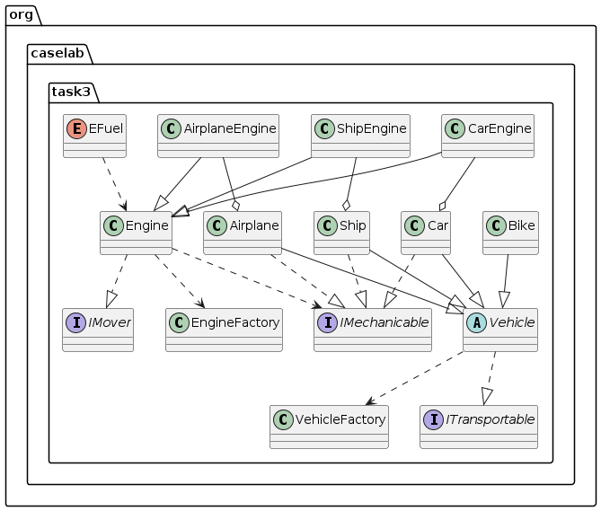

OUTPUT Example:
```
Choose garage size
2
Enter vehicle name
Ferrari
Choose transport type:[AIRPLANE, CAR, BIKE, SHIP]
car
Enter maximum capacity
4
Enter engine type: [AIRPLANE, CAR, SHIP, NONE]
car
Enter fuel type: [GASOLINE, DIESEL, ELECTRICITY, NUCLEAR]
diesel
Enter engine power
100
Enter vehicle name
Titanique
Choose transport type:[AIRPLANE, CAR, BIKE, SHIP]
ship
Enter maximum capacity
10000
Enter engine type: [AIRPLANE, CAR, SHIP, NONE]
ship
Enter fuel type: [GASOLINE, DIESEL, ELECTRICITY, NUCLEAR]
gasoline
Enter engine power
1000
1
Enter action type: [STATUS, SEAT, MOVE, ENGINE_ON, ENGINE_OFF, FILL]
status
Ship{engine=Engine{fuel=GASOLINE, power=1000, fuelLevel=EMPTY, engineStatus=false}, name='Titanique', wheels=[], capacity=Capacity{maximumCapacity=10000, currentCapacity=0}}
1
Enter action type: [STATUS, SEAT, MOVE, ENGINE_ON, ENGINE_OFF, FILL]
fill
1
Enter action type: [STATUS, SEAT, MOVE, ENGINE_ON, ENGINE_OFF, FILL]
status
Ship{engine=Engine{fuel=GASOLINE, power=1000, fuelLevel=FULL, engineStatus=false}, name='Titanique', wheels=[], capacity=Capacity{maximumCapacity=10000, currentCapacity=0}}
1
Enter action type: [STATUS, SEAT, MOVE, ENGINE_ON, ENGINE_OFF, FILL]
engine_on
1
Enter action type: [STATUS, SEAT, MOVE, ENGINE_ON, ENGINE_OFF, FILL]
move
Titanique is sailing on the sea.
0
Enter action type: [STATUS, SEAT, MOVE, ENGINE_ON, ENGINE_OFF, FILL]
seat
Capacity{maximumCapacity=4, currentCapacity=1}
0
Enter action type: [STATUS, SEAT, MOVE, ENGINE_ON, ENGINE_OFF, FILL]
move
java.lang.RuntimeException: java.lang.RuntimeException: Turn engine first!
0
Enter action type: [STATUS, SEAT, MOVE, ENGINE_ON, ENGINE_OFF, FILL]
engine_on
0
Enter action type: [STATUS, SEAT, MOVE, ENGINE_ON, ENGINE_OFF, FILL]
move
java.lang.RuntimeException: java.lang.RuntimeException: Fill the engine up first!
0
Enter action type: [STATUS, SEAT, MOVE, ENGINE_ON, ENGINE_OFF, FILL]
fill
0
Enter action type: [STATUS, SEAT, MOVE, ENGINE_ON, ENGINE_OFF, FILL]
move
Ferrari is driving on the road.
0
Enter action type: [STATUS, SEAT, MOVE, ENGINE_ON, ENGINE_OFF, FILL]
status
Car{engine=Engine{fuel=DIESEL, power=100, fuelLevel=FULL, engineStatus=true}, name='Ferrari', wheels=[Wheel{size=16}, Wheel{size=16}, Wheel{size=16}, Wheel{size=16}], capacity=Capacity{maximumCapacity=4, currentCapacity=1}}
```